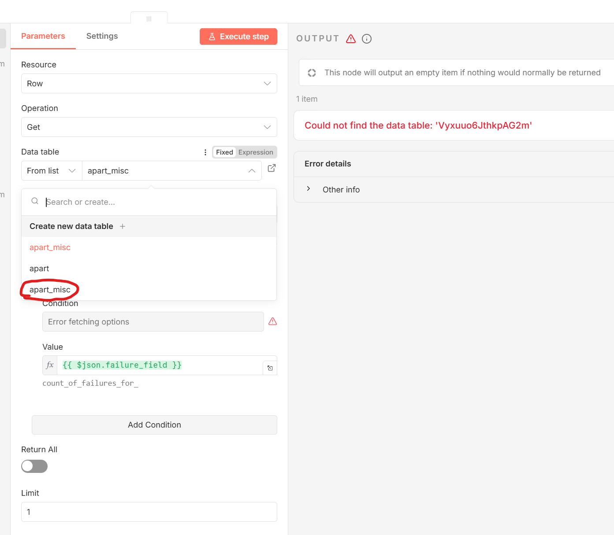
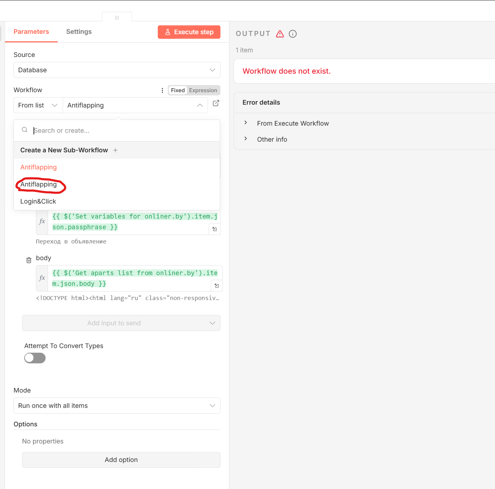

<p align="center">
  
</p>
Automated n8n workflow to scrape, filter, and notify about new apartment listings.

## Key features

* **Multi-site support:** Scrapes listings from multiple sites.
* **Intelligent automation:** Handles JavaScript rendering and button clicks (e.g., "show phone") using Puppeteer.
* **Data management:**
    * **Deduplication:** Checks against a local database (n8n data table) to ensure only new listings are processed.
    * **Filtering:** Filters out old listings (>24h) and specific keywords.
* **Alerts:**
    * **Interactive notifications:** Telegram messages include a button to disable future notifications for specific listings.
    * **Low info noise:** Designed to minimize the number of alerts, with a maximum of 1 notification per listing per day.

## Workflows

1.  **`Apart.json` (Main workflow):**
    *   Runs on a schedule to fetch listings.
    *   Parses HTML using Python.
    *   Filters, deduplicates, and saves data.
    *   Sends notifications to Telegram.
2.  **`Login&Click.json` (Helper):**
    *   Handles login procedures for sites requiring authentication.
    *   Clicks buttons to reveal hidden contact information (phone numbers).
3.  **`Antiflapping.json` (Monitoring):**
    *   Suppresses alerts during intermittent scraping errors.
4.  **`Watchdog.json` (Monitoring):**
    *   Global error handler that alerts on any workflow failure.


## Setup requirements

To run Browserless and enable external credentials in n8n:

```yaml
x-environment: &n8n-environment
  N8N_RUNNERS_MODE: external
  N8N_RUNNERS_ENABLED: true
  N8N_NATIVE_PYTHON_RUNNER: true
  NODE_FUNCTION_ALLOW_EXTERNAL: 'creds.js'
  N8N_BLOCK_ENV_ACCESS_IN_NODE: false
  BROWSERLESS_CONNECTION_STRING: 'ws://browser:3000/'
  APART_BROWSERLESS_PARAMS: '?--user-data-dir=apart_cache&stealth=false&headless=true'
  APART_TELEGRAM_CHAT_ID: 123456789
  APART_TELEGRAM_CALLBACK_DATA_DN_BUTTON_TEXT: 'Mute this listing'

services:
  n8n:
    image: n8nio/n8n:2.1.4
    environment: *n8n-environment
    volumes:
      - ./creds.js:/home/node/.n8n/nodes/node_modules/creds.js:ro

  browser:
    image: ghcr.io/browserless/chromium:v2.47.0
    environment:
      - TIMEOUT=240000

  # The following configuration is required to create classes in the code node:
  n8n-runner:
    image: n8nio/runners:2.1.4
    environment:
      - N8N_RUNNERS_STDLIB_ALLOW=json,re,html,time,datetime
      - N8N_RUNNERS_BUILTINS_DENY=eval,exec,compile,open,input,breakpoint,getattr,object,type,vars,setattr,delattr,hasattr,dir,memoryview,globals,locals
    volumes:
      - ./n8n-task-runners.json:/etc/n8n-task-runners.json:ro
```

## Installation

1.  Create a Telegram bot and set the token in the n8n credentials.
2.  Set environment variables and mount `creds.js` to n8n.
    * The Chat ID can be fetched from a test execution of the Telegram listener; simply send any message to the bot and you will see the `chat.id`. Put this in `APART_TELEGRAM_CHAT_ID` and restart n8n.
3.  Add the browser container.
4.  Install the `n8n-nodes-puppeteer@v1.4.1` community node in n8n.
5.  Create the necessary data tables, stored in `apart.csv` and `apart_misc.csv`.
    * All fields are `string`, except for `disableNotifications`, which is `boolean`.
6.  Import the workflow files.
    * Set the `Error Workflow parameter (to notify when the workflow fails)` to `Watchdog` on all workflows.
    * Check all Telegram nodes for the correct account.
    * Check all `Data table` and `Execute Workflow` nodes and choose the second entry from the list:
<p align="left">
  
  
</p>